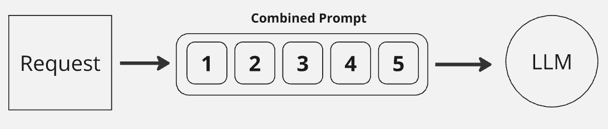

# Understanding Prompt Engineering in AI 

- In understanding what prompt engineering is about , the engineering of special crafted statements of what , how, and things that a prompt requires. This is in relationship to how to create task, or workflows that the AI model can interpet.

#### Types of Prompt Types 

##### Zero-Shot Prompting

This technique involves providing a direct instruction or question to the LLM without any additional context or examples. It's suitable for straightforward tasks where the model can infer the desired output from the prompt itself.

Example:

    Prompt: Translate "Hello, world!" to Spanish.
    Expected Output: ¡Hola, mundo!

##### Few-Shot Prompting

In this method, we provide the LLM with a few examples to illustrate the desired output format or task. This helps the model understand the task better and generate more accurate responses.

Example:

    Prompt: Translate the following phrases to French:
        "Good morning" - Bonjour
        "Thank you" - Merci
        "See you later" - À plus tard
    Input: Good evening
    Expected Output: Bonsoir

##### Chain-of-Thought (CoT) Prompting

CoT prompting aims to enhance the reasoning capabilities of LLMs by encouraging them to break down complex problems into smaller, more manageable steps. This step-by-step reasoning process is explicitly included in the prompt.

Example:

    Prompt: A basket contains 3 apples and 2 oranges. You add 1 more apple. How many fruits are in the basket now?
    CoT: First, there were 3 + 2 = 5 fruits. Then, 1 apple was added, so now there are 5 + 1 = 6 fruits.
    Expected Output: 6

###### Prompt Chaining

This technique involves decomposing a complex task into a sequence of simpler subtasks. The output of each subtask serves as input for the next, forming a chain-like process. This approach is beneficial for tasks that require multiple steps or involve intricate dependencies.

Example:

    Task: Write a short story about a cat who goes on an adventure.
    Subtask 1: Generate a character description for the cat.
    Subtask 2: Create a setting for the adventure.
    Subtask 3: Develop a plot outline with key events.
    Subtask 4: Write the actual story based on the generated elements.

## Thing to know 
- When building your Engineered prompt you would need to consider the following things about developing a engineered prompt. 

 
 1. Giving the prompt a meaningful profile, for example defining its characteristic. 
 2. Defining the Task that it should be doing 
 3. Defining conditions in terms of performing the tasks.
 4. Defining how to present that information that it will develop or provided. 
 5. Definding additional paramaters that it might need to finetune the results.  

#### 1. Giving Meaning to the Prompt 
- You would need to define what the prompt agent will be a professional at or what it is good at , usually you can define this as what type of profile you would want the agent to be like for example a professional teacher in physics, or chemestry or other areas of been a teacher. 

#### 2. The Task that it should do
- Remeber the Agent does not know what you are think and would need to understand what you are trying to achieve so defining what it needs to do and what it does not to helps it to be very specific to a topic. to do this you would need to define a few things that you want it to do based on what you are asking. for example writing a document. 

	- Give the document at Title 
	- Also create a Content page for the comment 
	- For each section made the Section text bold h4
	- Keep the language in the level of a Year 13 student
	- Provide Summary for each section
	- Provide a detail conclusion

- This is a simple example but there a other ways to use this defining for other types of agents and also the task that they need. 

#### 3. Providing Conditional Task 

- Usually this prompt would provide for areas that are not specific to the core of the the Task at hand which is main the main approach of the Task prompt here you can specify other fine tune ways to breat down other customization of the task prompt. for example define things such as. 

     - Provide version for English and Chinese 
     - Grammer checks for both language support. 
     - Using Best practice in terms of going the grammer checks. 

- So depending on the task at hand you would need to consider what could be some fo the areas that would go in to this customization to assist with prompts. conditions and what other paramaters that you seek to make or define. 

#### 4. Presentation View 

- Some system or application you can provide a prompt that will control the presentation of the the results provided by the agent. This would be using statement on how to display the content using different instruction such as the color of the text to use and the type of fonts to use if this is support by the Agent. 

#### 5. Context of Focus 

- Here this is where you now define what your prompt actually need to be done with additional information that you might give it, in other words this is where you give the agent a question or request that it need to perform. Also what is the technical requirement that is requires to complete. 

